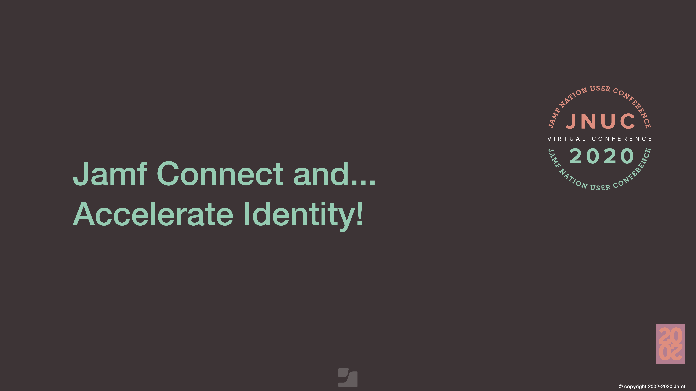

# Virtual JNUC2020 - slides and extra links

Welcome, here you'll find the slides and complementary info about our Jamf Nation User Conference 2020 talk.

### _"Jamf Connect and… Accelerate identity!"_

##### **Virtual JNUC 2020** presentation (Session: JNUC326):

- Listing of all Jamf Nation User Conference 2020 sessions [here](https://www.jamf.com/events/jamf-nation-user-conference/2020/sessions/)
- Our JNUC326 session slides [here](./pdf/JNUC-2020_JNUC326_accelerate_identity.pdf).



## Who are we ?

We are [Zentral Pro Services](https://www.zentral.pro/) - a consulting, research and development company.
We help clients unleash the potential of their Apple devices in a business environment.

We also build [Zentral opensource](https://github.com/zentralopensource/zentral/wiki).
We have created [IDent](https://www.ident.help) as a custom solution to improve identity provisioning to enterprise needs in a distributed fleet of Macs.

## Links

- Jamf Connect 2.0 Admin Guide - [scroll to "Advanced Login Authentication Settings"](https://docs.jamf.com/jamf-connect/administrator-guide/Login_Window_Preferences.html)
- JNUC talk JNUC326 slides [english version](./pdf/JNUC-2020_JNUC326_accelerate_identity.pdf)
- IDent info site and [customer inquiry](http://ident.help)
- HCS Whitepaper - [How to Configure Jamf Connect Login, Azure, and IDent for Certificate Provisioning](https://hcsonline.com/support/white-papers/how-to-configure-jamf-connect-login-azure-and-ident-for-certificate-provisioning)

---

## Related Topics

In this listing you can find some info that may help to get more in-depth with Jamf Connect, OpenID Connect and IDent topics.

## Talks

- OAuth 2.0 and OpenID Connect (in plain English) by OktaDev - <https://www.youtube.com/watch?v=996OiexHze0>
- Illustrated guide to OAuth and OpenID Connect - <https://www.youtube.com/watch?v=t18YB3xDfXI>

## Books

- <https://www.manning.com/books/oauth-2-in-action>

## Tools

- Decode Token (by Microsoft) <https://jwt.ms>

## A brief overview to OpenID Connect

OpenID Connect is a layer build on top of the OAuth 2.0 protocol.

This section strives to give a concise overview to the OpenID Connect protocol in relation to Jamf Connect _(all examples: Azure used as IdP)_.

## OAuth 2.0

OAuth2 may be well-known to anyone who's used something like a "Sign in with Facebook/Google/LinkedIn/GitHub" process.
The application a user will try to log in will use an outside provider (the identity provider) to attest a users identity instead of having the user insert a username and password with the application itself.

The interaction between the application and the outside provider proceeds with this kind of flow:

1. A user visits an application.
2. The application redirects the user to "Sign in with..." to press a button to sign in with an identity provider.
3. The user logs into the identity provider (sign in happens with Facebook/Google/GitHub. etc.), which sends an authentication request. User is asked if it's ok to let the application view the user's profile, and perform some authorized actions on their behalf.
4. If the user clicks Ok, the identity provider redirects the user back to the application with a temporary secret.
5. The application redeems that temporary secret with the identity provider for a token that can be used to access the authorized operations.

In Jamf Connect as well as with IDent the "provider" in the OpenID Connect flow will redirect a client apps to attest for the end user's identity.

- <https://docs.microsoft.com/en-us/azure/active-directory/develop/authentication-flows-app-scenarios>

## ID Token

The access token applications get from an OAuth 2.0 provider are opaque to the client and in fact will vary in the format returned depending on the identity provider used. The access token you receive from Facebook will be entirely different from the one you get from Google or GitHub.
OpenID Connect's primary extension of OAuth 2.0 is an additional token returned in the token response referred to as the ID Token. This token is a JSON Web Token signed by the OpenID Connect server, with well known fields for user ID, name, upn, etc.

Here you can seee an example ID token response from an OpenID Connect _(example: drafted from Azure)_:

```json
{
  "access_token": "5H0yN0QQ2VBgkRTyf7HlsW-sFX1nAjR4YOTj2s5Vuz85_SYbA3y3qAaYAtKgFZZqiSa75u62M2jk_VhJORK3Gx8gCElsW3SrpO-<REMOVED_FOR_CLARITY>-cSHmtN50CxNVT066Q1DbM5AMrc8Nw1yl07lSFucuspQRcCXJQ2",
  "expires_in": "3599",
  "expires_on": "1601303638",
  "ext_expires_in": "3599",
  "id_token": "aznCND9ct6zu8kVkXiSJB1SB<REMOVED_FOR_CLARITY>E3rlFJC.Hzgajt8QkmlK6ugGUXXSKg50v7jzfylwqR<REMOVED_FOR_CLARITY>uSN.2J0N3<REMOVED_FOR_CLARITY>fCR_Slam",
  "id_token_decoded": {
    "amr": ["pwd", "mfa"],
    "aud": "5905dcf2-2873-4dfb-87fc-c8165db8cf4c",
    "exp": 1601303638,
    "family_name": "Appleseed",
    "given_name": "John",
    "groups": [
      "67610c8b-e288-4d6d-a0fb-564808aaff79",
      "490b6910-dacd-4c20-993c-d187c12bedab",
      "f89f9a56-8d12-4dd8-8a99-0ba727c8c737",
      "3c2ec84e-22c5-42d6-8ef3-0f820f871d20"
    ],
    "iat": 1601299738,
    "ipaddr": "92.158.165.xxx",
    "iss": "https://sts.windows.net/8f27e724-0190-11eb-adc1-0242ac120002/",
    "name": "John Appleseed",
    "nbf": 1601299738,
    "oid": "eedaa16a-e721-42ce-8696-bf77ec704104",
    "rh": "0.AAAA3qnqydQIXE-lm_nn_sp7ur4kIi9T6uVBin0vrwZHfXs5AIg.",
    "sub": "XU4WmgjxUh6ptVcvmYugjXyy40bUVcTNHJaX0FIoZs2kw6KdPC",
    "tid": "8f27e724-0190-11eb-adc1-0242ac120002",
    "unique_name": "jappleseed@example.com",
    "email": "jappleseed@example.com",
    "uti": "XCD7-2kvGVSgM9qqt6cDS",
    "ver": "1.0",
    "wids": [
      "cc91b6f4-a01d-43b2-8110-3553431a047d",
      "2e65f4bd-a220-4864-abaf-c9efa28e8b5c"
    ]
  },
  "id_token_header_decoded": {
    "alg": "RS256",
    "kid": "9MEFkLjLaBCsF3uawZUZqoCnaT",
    "typ": "JWT",
    "x5t": "9MEFkLjLaBCsF3uawZUZqoCnaT"
  },
  "refresh_token": "0.AAAA3qnqydQIXE-lm_nn_sp7ur4kIi9T6uVBin0vrwZHfXs5AIg.8E815jQ7ZyDPYkBOKNUgi-HOxBVD4S5JDe9-<REMOVED_FOR_CLARITY>-s9CaeJi4ZkeDA6WSbBiTD9jxMIL8eIBzKTjkgvU5CL6iorHHon",
  "token_type": "Bearer",
  "userinfo": {
    "amr": "[\"pwd\",\"mfa\"]",
    "family_name": "Appleseed",
    "given_name": "John",
    "groups": [
      "[\"67610c8b-e288-4d6d-a0fb-564808aaff79\",\"490b6910-dacd-4c20-993c-d187c12bedab\",\"f89f9a56-8d12-4dd8-8a99-0ba727c8c737\",\"3c2ec84e-22c5-42d6-8ef3-0f820f871d20\"]"
    ],
    "ipaddr": "92.158.165.xxx",
    "name": "John Appleseed",
    "oid": "eedaa16a-e721-42ce-8696-bf77ec704104",
    "rh": "0.AAAA3qnqydQIXE-lm_nn_sp7ur4kIi9T6uVBin0vrwZHfXs5AIg.",
    "sub": "XU4WmgjxUh6ptVcvmYugjXyy40bUVcTNHJaX0FIoZs2kw6KdPC",
    "tid": "aa2aee83-f8d2-4659-9f9e-a8af4723b52d",
    "unique_name": "jappleseed@example.com",
    "email": "jappleseed@example.com",
    "uti": "fXRchA91c0Ga8n1RUH6CAA",
    "ver": "1.0",
    "wids": "[\"cc91b6f4-a01d-43b2-8110-3553431a047d\",\"2e65f4bd-a220-4864-abaf-c9efa28e8b5c\"]"
  }
}
```

In the ID Token payload claims we can find some fields of interest:

| Claim       |                Short                |                                                                                                                                 Description |
| ----------- | :---------------------------------: | ------------------------------------------------------------------------------------------------------------------------------------------: |
| sub         |        Token's subject (sub)        |                                                 A unique ID, the principal information which the token asserts, i.e. the end user of an app |
| iss         | Server that issued this token (iss) | Identifies the security token service (STS) that constructs and returns the token, i.e. the Azure AD tenant in which the user authenticated |
| aud         |       Token's audience (aud)        |                                                                       The Application ID, the intended recipient the request was issued for |
| unique_name | Token's subject user (unique_name)  |                                                                   Provides a human readable value that identifies the subject of the token. |
| email       |  Token's user mail address (email)  |                                                                                        Token details for the email OpenID Connect in scope. |

Some more detailed descriptions (from Azure) can be seen here:

- <https://docs.microsoft.com/en-us/azure/active-directory/develop/id-tokens>
- Header Claims <https://docs.microsoft.com/en-us/azure/active-directory/develop/id-tokens#header-claims>
- Payload Claims <https://docs.microsoft.com/en-us/azure/active-directory/develop/id-tokens#payload-claims>

## Discovery URL

OpenID Connect servers have a discovery mechanism for OAuth 2.0 endpoints, this present the claims supported, and gives indications of other OpenID Connect features used.

The Discovery URL details will looks as displayed in this example:
`https://login.microsoftonline.com/5905dcf2-2873-4dfb-87fc-c8165db8cf4c/v2.0/.well-known/openid-configuration`

```json
{
  "token_endpoint": "https://login.microsoftonline.com/5905dcf2-2873-4dfb-87fc-c8165db8cf4c/oauth2/v2.0/token",
  "token_endpoint_auth_methods_supported": [
    "client_secret_post",
    "private_key_jwt",
    "client_secret_basic"
  ],
  "jwks_uri": "https://login.microsoftonline.com/5905dcf2-2873-4dfb-87fc-c8165db8cf4c/discovery/v2.0/keys",
  "response_modes_supported": ["query", "fragment", "form_post"],
  "subject_types_supported": ["pairwise"],
  "id_token_signing_alg_values_supported": ["RS256"],
  "response_types_supported": [
    "code",
    "id_token",
    "code id_token",
    "id_token token"
  ],
  "scopes_supported": ["openid", "profile", "email", "offline_access"],
  "issuer": "https://login.microsoftonline.com/5905dcf2-2873-4dfb-87fc-c8165db8cf4c/v2.0",
  "request_uri_parameter_supported": false,
  "userinfo_endpoint": "https://graph.microsoft.com/oidc/userinfo",
  "authorization_endpoint": "https://login.microsoftonline.com/5905dcf2-2873-4dfb-87fc-c8165db8cf4c/oauth2/v2.0/authorize",
  "device_authorization_endpoint": "https://login.microsoftonline.com/5905dcf2-2873-4dfb-87fc-c8165db8cf4c/oauth2/v2.0/devicecode",
  "http_logout_supported": true,
  "frontchannel_logout_supported": true,
  "end_session_endpoint": "https://login.microsoftonline.com/5905dcf2-2873-4dfb-87fc-c8165db8cf4c/oauth2/v2.0/logout",
  "claims_supported": [
    "sub",
    "iss",
    "cloud_instance_name",
    "cloud_instance_host_name",
    "cloud_graph_host_name",
    "msgraph_host",
    "aud",
    "exp",
    "iat",
    "auth_time",
    "acr",
    "nonce",
    "preferred_username",
    "name",
    "tid",
    "ver",
    "at_hash",
    "c_hash",
    "email"
  ],
  "tenant_region_scope": "EU",
  "cloud_instance_name": "microsoftonline.com",
  "cloud_graph_host_name": "graph.windows.net",
  "msgraph_host": "graph.microsoft.com",
  "rbac_url": "https://pas.windows.net"
}
```

Some more detailed description:

- <https://docs.microsoft.com/en-us/azure/active-directory/develop/v2-protocols-oidc>

## Public Keys

A set of public keys to verify the signatures is provided as well:

The Key URL details will looks as displayed in this example:

`https://login.microsoftonline.com/5905dcf2-2873-4dfb-87fc-c8165db8cf4c/discovery/v2.0/keys`

```json
{
  "keys": [
    {
      "kty": "RSA",
      "use": "sig",
      "kid": "9MEFkLjLaBCsF3uawZUZqoCnaT",
      "x5t": "9MEFkLjLaBCsF3uawZUZqoCnaT",
      "n": "2YX-YDuuTzPiaiZKt04IuUzAjCjPLLmBCVA6npKuZyIouMuaSEuM7BP8QctfCprUY16Rq2-KDrAEvaaKJvsD5ZONddt79yFdCs1E8wKlYIPO74fSpePdVDizflr5W-QCFH9tokbZrHBBuluFojgtbvPMXAhHfZTGC4ItZ0i_Lc9eXwtENHJQC4e4m7olweK1ExM-OzsKGzDlOsOUOU5pN2sHY74nXPqQRH1dQKfB0NT0YrfkbnR8fiq8z-soixfECUXkF8FzWnMnqL6X90wngnuIi8OtH2mvDcnsvUVh3K2JgvSgjRWZbsDx6G-mVQL2vEuHXMXoIoe8hd1ZpV16pQ",
      "e": "AQAB",
      "x5c": [
        "MIIDBTCCAe2gAwIBAgIQUUG7iptQUoVA7bYvX2tHlDANBgkqhkiG9w0BAQsFADAtMSswKQYDVQQDEyJhY2NvdW50cy5hY2Nlc3Njb250cm9sLndpbmRvd3MubmV0MB4XDTIwMDcxODAwMDAwMFoXDTI1MDcxODAwMDAwMFowLTErMCkGA1UEAxMiYWNjb3VudHMuYWNjZXNzY29udHJvbC53aW5kb3dzLm5ldDCCASIwDQYJKoZIhvcNAQEBBQADggEPADCCAQoCggEBANmF/mA7rk8z4momSrdOCLlMwIwozyy5gQlQOp6SrmciKLjLmkhLjOwT/EHLXwqa1GNekatvig6wBL2miib7A+WTjXXbe/chXQrNRPMCpWCDzu+H0qXj3VQ4s35a+VvkAhR/baJG2axwQbpbhaI4LW7zzFwIR32UxguCLWdIvy3PXl8LRDRyUAuHuJu6JcHitRMTPjs7Chsw5TrDlDlOaTdrB2O+J1z6kER9XUCnwdDU9GK35G50fH4qvM/rKIsXxAlF5BfBc1pzJ6i+l/dMJ4J7iIvDrR9prw3J7L1FYdytiYL0oI0VmW7A8ehvplUC9rxLh1zF6CKHvIXdWaVdeqUCAwEAAaMhMB8wHQYDVR0OBBYEFFOUEOWLUJOTFTOlr7P+6GxsmM90MA0GCSqGSIb3DQEBCwUAA4IBAQCP+LLZw7SSYnWQmRGWHmksBwwJ4Gy32C6g7+wZZv3ombHW9mwLQuzsir97/PP042i/ZIxePHJavpeLm/z3KMSpGIPmiPtmgNcK4HtLTEDnoTprnllobOAqU0TREFWogjkockNo98AvpsmHxNMXuwDikto9o/d9ACBtpkpatS2xgVOZxZtqyMpwZzSJARD5A4qcKov4zdqntVyjpZGK4N6ZaedRbEVd12m1VI+dtDB9+EJRqtTn8zamPYljVTEPNCbDAFgKBDtrhwBnrrrnKTq4/LEOouNQZuUucBTMOGDn4FEejNh3qbxNdWR6tSZbXUnJ+NIQ99IqZMvvMqm9ndL7"
      ],
      "issuer": "https://login.microsoftonline.com/5905dcf2-2873-4dfb-87fc-c8165db8cf4c/v2.0"
    }
  ]
}
```
